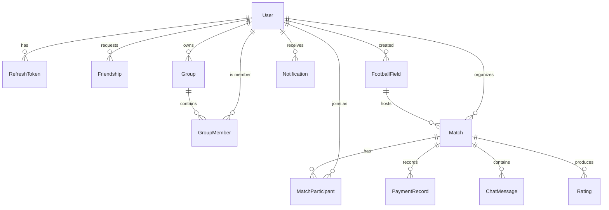

# Document Information

**Status:** Implemented

**Version:** 2.0

**Last Updated:** 2026-06-30

**Owner:** Kawwer Team

---

# Database Design

This document describes the entities and relationships used by the Kawwer application.

It is the authoritative description of the data model and is kept in sync with the Entity
Framework Core configurations under `Kawwer.Infrastructure/Persistence/Configurations` and the
EF migration `InitialCreate`. Every entity here maps to a PostgreSQL table.

> **Note on lifecycle entities.** Following decisions **D-003**, **D-004** and **D-012**, the
> invitation, response, waiting list, attendance, payment state, location sharing and rating flags
> for a player all live on a single `MatchParticipant` row rather than in separate tables. The
> immutable cash-payment ledger is the one exception and lives in `PaymentRecord`.

---

# Entity List

| Entity | Table | Aggregate Root |
|--------|-------|----------------|
| User | `users` | Yes |
| RefreshToken | `refresh_tokens` | No |
| Friendship | `friendships` | No |
| Group | `groups` | Yes |
| GroupMember | `group_members` | No |
| FootballField | `football_fields` | Yes |
| Match | `matches` | Yes |
| MatchParticipant | `match_participants` | No (owned by Match) |
| PaymentRecord | `payment_records` | No |
| Notification | `notifications` | No |
| ChatMessage | `chat_messages` | No |
| Rating | `ratings` | No |

All primary keys are `UUID` (`Guid`). All timestamps are stored in UTC.

---

# Users

Represents every registered user of the application.

| Field | Type | Required | Notes |
|--------|------|----------|-------|
| Id | UUID | Yes | Primary Key |
| Username | String(50) | Yes | Unique index |
| Email | String(255) | Yes | Unique index |
| PasswordHash | String | Yes | BCrypt hash, never plain text |
| FirstName | String(100) | Yes | |
| LastName | String(100) | Yes | |
| PhoneNumber | String(30) | No | |
| ProfilePictureUrl | String(500) | No | |
| BirthDate | Date | No | |
| PreferredPosition | Enum | No | Goalkeeper, Defender, Midfielder, Forward |
| PreferredFoot | Enum | No | Left, Right, Both |
| SkillLevel | Integer | No | Range 1–10 |
| Reputation | Decimal(5,2) | Yes | Starts at 100, clamped to 0–100 |
| Visibility | Enum | Yes | Public, FriendsOnly, Private |
| Status | Enum | Yes | Active, Suspended, Deleted |
| FailedLoginAttempts | Integer | Yes | Drives lockout |
| LockedUntil | DateTime | No | Set when attempts exceed the limit |
| DeviceToken | String(500) | No | FCM push registration token |
| CreatedAt | DateTime | Yes | |
| LastLogin | DateTime | No | |

The **reliability badge** (VeryReliable, Reliable, OccasionallyCancels, OftenLate,
FrequentNoShow) is derived from `Reputation` and is not stored.

---

# Refresh Tokens

Revocable tokens used to mint new short-lived JWT access tokens (see `docs/Authentication.md`).

| Field | Type | Required | Notes |
|--------|------|----------|-------|
| Id | UUID | Yes | Primary Key |
| UserId | UUID | Yes | References Users (indexed) |
| Token | String(200) | Yes | Unique index |
| ExpiresAt | DateTime | Yes | 30 days from issue |
| CreatedAt | DateTime | Yes | |
| RevokedAt | DateTime | No | Set on logout/rotation; a token is active only when not revoked and not expired |

---

# Friendships

Represents friendship relationships between users. A directed record; the pair
(`UserId` → `FriendId`) is unique. A mutual friendship is the single record reaching `Accepted`.

| Field | Type | Required | Notes |
|--------|------|----------|-------|
| Id | UUID | Yes | Primary Key |
| UserId | UUID | Yes | Requester (references Users) |
| FriendId | UUID | Yes | Addressee (references Users, indexed) |
| Status | Enum | Yes | Pending, Accepted, Blocked |
| CreatedAt | DateTime | Yes | |
| RespondedAt | DateTime | No | |

Unique index on (`UserId`, `FriendId`).

---

# Groups

A private, owner-scoped collection of players that speeds up match invitations.

| Field | Type | Required | Notes |
|--------|------|----------|-------|
| Id | UUID | Yes | Primary Key |
| OwnerId | UUID | Yes | References Users (indexed) |
| Name | String(50) | Yes | |
| Description | String(250) | No | |
| CreatedAt | DateTime | Yes | |

---

# Group Members

Membership of users inside groups.

| Field | Type | Required | Notes |
|--------|------|----------|-------|
| Id | UUID | Yes | Primary Key |
| GroupId | UUID | Yes | References Groups |
| UserId | UUID | Yes | References Users |
| AddedAt | DateTime | Yes | |

Unique index on (`GroupId`, `UserId`).

---

# Football Fields

Reusable locations where matches are played. Price and fee changes affect only **future** matches,
because each `Match` snapshots the price at creation time (decision **D-005**).

| Field | Type | Required | Notes |
|--------|------|----------|-------|
| Id | UUID | Yes | Primary Key |
| Name | String(150) | Yes | |
| Address | String(300) | Yes | |
| Latitude | Decimal(9,6) | Yes | |
| Longitude | Decimal(9,6) | Yes | |
| Capacity | Integer | Yes | 10, 12, 14, 16… |
| MatchDurationMinutes | Integer | Yes | Usually 90 |
| Price | Decimal(10,2) | Yes | |
| ReservationFee | Decimal(10,2) | Yes | |
| Surface | Enum | Yes | ArtificialTurf, NaturalGrass, Concrete |
| Indoor | Boolean | Yes | |
| Parking | Boolean | Yes | |
| Shower | Boolean | Yes | |
| Lights | Boolean | Yes | |
| PhoneNumber | String(30) | No | |
| GoogleMapsUrl | String(500) | No | |
| Notes | String(1000) | No | |
| CreatedBy | UUID | Yes | References Users (indexed) |
| CreatedAt | DateTime | Yes | |
| UpdatedAt | DateTime | Yes | |

---

# Matches

A football game organized by one user at a football field. Aggregate root that owns its
participants and enforces the match lifecycle and the money split.

| Field | Type | Required | Notes |
|--------|------|----------|-------|
| Id | UUID | Yes | Primary Key |
| OrganizerId | UUID | Yes | References Users (indexed) |
| FootballFieldId | UUID | Yes | References Football Fields (indexed) |
| Title | String(150) | Yes | |
| Description | String(1000) | No | |
| Visibility | Enum | Yes | Private, Public |
| Status | Enum | Yes | Draft, Published, Full, Playing, Finished, Cancelled |
| MatchDate | Date | Yes | |
| StartTime | Time | Yes | |
| EndTime | Time | Yes | Derived from StartTime + duration |
| DurationMinutes | Integer | Yes | Snapshotted from the field |
| MaxPlayers | Integer | Yes | Includes the organizer's slot |
| TotalFieldPrice | Decimal(10,2) | Yes | Snapshotted at creation |
| ReservationPaid | Decimal(10,2) | Yes | Snapshotted at creation |
| AutoAcceptPublic | Boolean | Yes | Auto-approve public join requests |
| PaymentCollectionStarted | Boolean | Yes | |
| PaymentCompleted | Boolean | Yes | When true, payments are read-only |
| LiveMatchStarted | Boolean | Yes | |
| PinnedMessageId | UUID | No | The single pinned chat message |
| CreatedAt | DateTime | Yes | |
| UpdatedAt | DateTime | Yes | |

Composite index on (`Visibility`, `Status`, `MatchDate`) to drive the public Discover feed.

**Derived (not stored):** `SpotsForInvitees` = MaxPlayers − 1, `RemainingAmount` =
TotalFieldPrice − ReservationPaid, `SharePerPlayer` = ⌈RemainingAmount / AcceptedCount⌉,
`CollectedAmount`, `MissingAmount`, `IsFull`.

---

# Match Participants

The relationship between a user and a match. A single row carries the player's whole lifecycle:
invitation, response, waiting list, **attendance**, **payment state**, **location sharing** and
rating flags (decisions **D-003**, **D-004**, **D-012**).

| Field | Type | Required | Notes |
|--------|------|----------|-------|
| Id | UUID | Yes | Primary Key |
| MatchId | UUID | Yes | References Matches |
| UserId | UUID | Yes | References Users (indexed) |
| Status | Enum | Yes | Invited, Seen, Thinking, Accepted, Declined, WaitingList, Removed, Cancelled |
| IsJoinRequest | Boolean | Yes | True when created from a public-match join request |
| WaitingListPosition | Integer | No | First-accepted, first-promoted order (D-013) |
| InvitedAt | DateTime | Yes | |
| SeenAt | DateTime | No | |
| RespondedAt | DateTime | No | |
| JoinedAt | DateTime | No | |
| LeftAt | DateTime | No | |
| PaidAmount | Decimal(10,2) | Yes | Cumulative cash recorded |
| PaymentCompleted | Boolean | Yes | |
| Attendance | Enum | Yes | Unknown, Travelling, Present, Late, NoShow |
| SharedLocation | Boolean | Yes | |
| Latitude | Decimal(9,6) | No | Last shared location |
| Longitude | Decimal(9,6) | No | Last shared location |
| LocationUpdatedAt | DateTime | No | |
| RatedOrganizer | Boolean | Yes | Has this player rated the organizer |
| RatedPlayers | Boolean | Yes | Has this player rated the other players |
| CreatedAt | DateTime | Yes | |

Unique index on (`MatchId`, `UserId`). **Payment status** (NotPaid, PartiallyPaid, Paid) is
derived from `PaidAmount` and `PaymentCompleted`.

---

# Payment Records

The immutable cash-payment ledger. Each row is one payment recorded by an organizer against a
participant; it provides the auditable payment history (see `docs/Payments.md`). Participant-level
running totals live on `MatchParticipant.PaidAmount`.

| Field | Type | Required | Notes |
|--------|------|----------|-------|
| Id | UUID | Yes | Primary Key |
| MatchId | UUID | Yes | References Matches (indexed) |
| PayerId | UUID | Yes | The participant who paid |
| RecordedBy | UUID | Yes | The organizer who recorded it |
| Amount | Decimal(10,2) | Yes | Non-negative |
| CreatedAt | DateTime | Yes | Timestamp of the payment |

---

# Notifications

A persistent in-app notification. Every push notification also creates one of these
(decision **D-016**); see `docs/Notifications.md`.

| Field | Type | Required | Notes |
|--------|------|----------|-------|
| Id | UUID | Yes | Primary Key |
| UserId | UUID | Yes | Recipient (references Users) |
| Category | Enum | Yes | Match, Invitation, Payment, LiveMatch, Friend, Group, WaitingList |
| Title | String(150) | Yes | |
| Message | String(1000) | Yes | |
| RelatedMatchId | UUID | No | Deep-link target |
| IsRead | Boolean | Yes | |
| CreatedAt | DateTime | Yes | |

Indexes on (`UserId`, `IsRead`) and on `CreatedAt`.

---

# Chat Messages

A message in a match's temporary chat room (see `docs/MatchChat.md`). Replaces the separate
"Chats" and "Messages" entities from the original sketch: one match has one implicit chat room,
so messages reference the match directly.

| Field | Type | Required | Notes |
|--------|------|----------|-------|
| Id | UUID | Yes | Primary Key |
| MatchId | UUID | Yes | References Matches |
| SenderId | UUID | No | Null for system messages |
| Type | Enum | Yes | User, System |
| Content | String(2000) | Yes | Emptied on soft delete |
| IsDeleted | Boolean | Yes | Soft delete |
| IsEdited | Boolean | Yes | |
| CreatedAt | DateTime | Yes | |
| EditedAt | DateTime | No | |

Composite index on (`MatchId`, `CreatedAt`) for chronological paging. Users may edit or delete
their own messages within a five-minute window; system messages are immutable.

---

# Ratings

An anonymous five-star rating submitted after a finished match. Statistics and reputation are
derived from these rows (decisions **D-017**, **D-022**); see `docs/RatingsAndReputation.md`.

| Field | Type | Required | Notes |
|--------|------|----------|-------|
| Id | UUID | Yes | Primary Key |
| MatchId | UUID | Yes | References Matches |
| RaterId | UUID | Yes | Who gave the rating |
| RateeId | UUID | Yes | Who is rated (indexed); cannot equal RaterId |
| Type | Enum | Yes | Organizer, Player |
| Stars | Integer | Yes | 1–5 |
| Comment | String(500) | No | |
| CreatedAt | DateTime | Yes | |

Unique index on (`MatchId`, `RaterId`, `RateeId`, `Type`) — one rating per rater/ratee/type/match.

---

# Attendance & Location Sharing

These are **not** separate tables. Attendance (`Attendance`) and live location
(`SharedLocation`, `Latitude`, `Longitude`, `LocationUpdatedAt`) are fields on
`MatchParticipant`, as described above and in `docs/LiveMatch.md`.

---

# Relationships Overview

---

# Business Rules Enforced in the Model

- A match must allow at least two players.
- Capacity cannot drop below the number of accepted players.
- The waiting list uses a strict first-accepted, first-promoted order (**D-013**).
- Payment collection can only finish when the remaining amount reaches zero; finished
  collections are read-only.
- Payment amounts cannot be negative; overpayments are allowed.
- Ratings are 1–5 stars and a user cannot rate themselves.
- A user cannot befriend themselves; the (UserId, FriendId) pair is unique.

---

# Acceptance Criteria

- Every entity above maps to a table in the `InitialCreate` migration.
- Unique and lookup indexes match this document.
- Money and coordinate columns use the documented precision.
- Lifecycle state for a participant is stored on a single `MatchParticipant` row.
